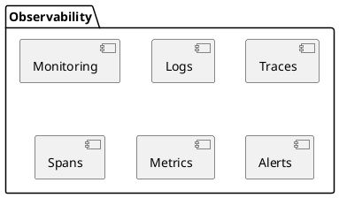

--- 
theme: default
background: 
title: OTel with Elastic
transition: slide-left
layover: cover
--- 


Ashish Tiwari  
Senior Developer Advocate


---
layout: default
---

# Monitoring != Observability

<br>
<br>
<br>

<div class="grid grid-cols-3 gap-4">
  <div v-click>
 
   <carbon-cloud-monitoring class="text-4xl text-orange-400 animate-ping" />
    
   <br>
   <br>
   <br>

   - When & What  
        - Monitor
        - Watch
        - Trigger
        - Alert
    
    
  </div>
  <div v-click>
  
   <carbon-observed-hail class="text-4xl text-orange-400 animate-ping" />

   <br>
   <br>
   <br>

   * Why & How
        * RCA
        * Detection
        * Correlations
        * Anomaly detection
  
  </div>
  <div v-click class="mt-25">


  </div>
</div>


---
layout: image
image: elastic-overview.png
---


---
layout: default
---


<br>

<div v-click>
  OpenTelemetry is an Observability <span v-mark.red="2">framework and toolkit</span> designed to create and manage telemetry data such as traces, metrics, and logs.
</div>  

<br>
<br>

<div class="grid grid-cols-3 gap-4">
<div>
  

  <v-clicks depth=2>

  - Why OTel?
    - No Vendor lock-in
    - Single set of APIs and conventions
    - Easy switch among [backend](https://opentelemetry.io/ecosystem/vendors/)

  </v-clicks>

</div>
<div>

 
  <v-clicks depth=2>

  - Instrumentation
    - Zero code (auto): Bytecode, monkey patching, eBPF etc. 
    - Code-based (manual): OTel API & SDKs
    - Libraries and Frameworks 

  </v-clicks>

</div>
<div v-click>

- Language APIs & SDKs

<logos-java class="text-2xl text-red-400 mx-5" />
<logos-php class="text-2xl text-red-400 mx-5" />
<logos-go class="text-2xl text-red-400 mx-5" />
<br>
<br>
<logos-nodejs class="text-2xl text-red-400 mx-5" />
<logos-javascript class="text-2xl text-red-400 mx-5" />
<logos-python class="text-2xl text-red-400 mx-5" />
<br>
<br>
<logos-ruby class="text-2xl text-red-400 mx-5" />
<logos-rust class="text-2xl text-red-400 mx-5" />
<logos-swift class="text-2xl text-red-400 mx-5" />

</div>
</div>

<v-click>

Checkout the [registry](https://opentelemetry.io/ecosystem/registry/) to know about instrumentation libraries, collector components, utilities, and other useful projects in the OpenTelemetry ecosystem.

</v-click>

---
layout: default
image: https://images.contentstack.io/v3/assets/bltefdd0b53724fa2ce/blt9db95546b0aabeb0/663eec3e3a5cb33cf36704dd/diagram-opentelemetry.png
---

# OTel -> Elastic

Get telemetry data into Elastic


---
layout: default
---

# Let's see how it works with Flask - Python web framework

Flask is a micro web framework written in Python. It use to build lightweight web applications quickly.

<div class="grid grid-cols-2 gap-4">

<div>
```sh
pip install flask
```


```sh {0|1-3|5-6|8-15}
# install dependency
pip install opentelemetry-distro
opentelemetry-bootstrap -a install

# run flask app
flask run -p 8080

# run instrumented flask app 
export OTEL_PYTHON_LOGGING_AUTO_INSTRUMENTATION_ENABLED=true
opentelemetry-instrument \
    --traces_exporter console \
    --metrics_exporter console \
    --logs_exporter console \
    --service_name dice-server \
    flask run -p 8080

```
</div>
<div>

app.py

```py {all}
from flask import Flask
app = Flask(__name__)

@app.route('/')
def hello_world():
    return 'Hello, World!'
```

https://opentelemetry.io/docs/languages/python/

</div>
</div>

---
layout: center
---

# Demo - ElasticFlix
https://github.com/elastic/observability-examples/tree/main/Elastiflix

---
layout: default
---

# Get started with OTel + Elastic

| | |
| --- | --- |
| Independence with OpenTelemetry on Elastic | https://www.elastic.co/observability-labs/blog/opentelemetry-observability |
| What is OTel | https://www.elastic.co/what-is/opentelemetry |
| Semantic Conventions for Elasticsearch | https://opentelemetry.io/docs/specs/semconv/database/elasticsearch/ |
| Instrumentation | https://opentelemetry.io/docs/concepts/instrumentation/  |
| Other concepts | Baggage, Context Propogation |
| OTel | https://opentelemetry.io | 

---
layout: end
---

# Thank You 


<span><carbon-logo-linkedin /> in/ashishtiwari93 </span>  
<span><carbon-logo-twitter /> @_ashish_tiwari </span>

